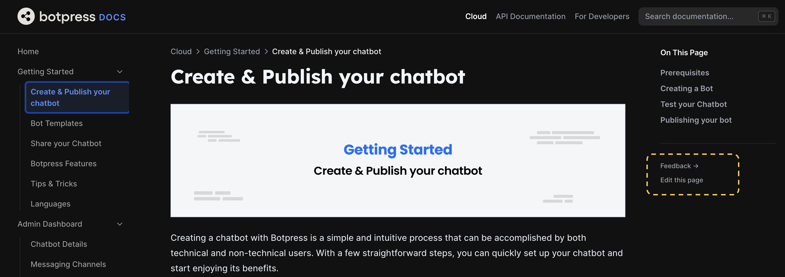

## Getting Started

1. First, install the dependencies

```bash
pnpm install
```

2. Run the API documentation generator script:

```bash
pnpm generate
```

3. Then run the development server:

```bash
pnpm dev
```

Open [http://localhost:3000/docs](http://localhost:3000/docs) with your browser and you should see the local instance of documentation running.

## About Nextra and Next.js

This projects is based on [Nextra](https://nextra.site/) which is built on top of [Next.js](https://nextjs.org/). Although knowledge of these is not a prerequisite for contributing, here are some links to quickly get you started on some concepts used in this project:

1. [Nextra Markdown Guide](https://nextra.site/docs/guide/markdown)
2. [Nextra Page Configuration](https://nextra.site/docs/docs-theme/page-configuration)
3. [Next.js Routing](https://nextjs.org/docs/pages/building-your-application/routing)

## Contributing

You can contribute by raising a PR or [Pull Request](https://docs.github.com/en/pull-requests/collaborating-with-pull-requests/proposing-changes-to-your-work-with-pull-requests/about-pull-requests) directly on this Github Repo. The second option is by going to a documetation and clicking on the **Edit this Page** link. This will take you to the relevant file on the Github Repo where you can edit the file, [author a commit](#authoring-commits) for your change, and then raise a Pull Request. You can also contribute indirectly by leaving us your valuable feedback that helps us constantly improve our products 🚀.


_The **Feedback** and **Edit this page** links can be found on the bottom right corner of most pages_

### Authoring Commits

At Botpress Engineering, and by extension in this repository, we follow the [Conventional Commits](https://www.conventionalcommits.org/en/v1.0.0/#examples) standard. This makes sure that each commit clearly describes what it is about.

### Previews

When you raise a PR, after a few minutes you can inspect the preview link of the change you made. Click on the **Visit Preview** preview link. 💡 _Please make sure you append `/docs` at the end of the link_.

### Approval Process

Before your change is reflected on the live documentation website, your PR has to be approved by two members of the Botpress Engineering team. Though we try to act on every PR as soon as possible, in some cases this process might take up to two weeks.

## Known issues

There's an issue in Nextra's Table of Contents `TOC` components that can cause the TOC element to scroll up and back to a link/slug that shouldn't be in focus.

[Link to the issue](https://github.com/shuding/nextra/issues/2020)
